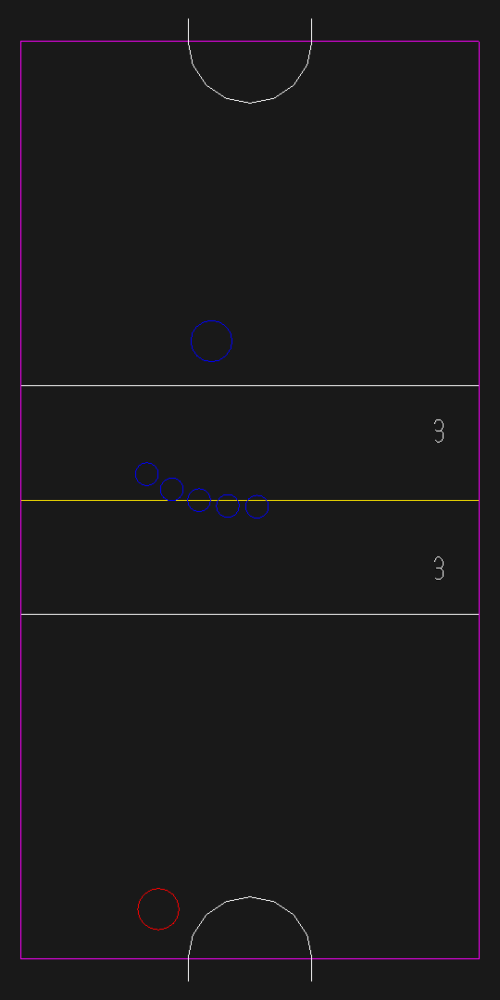

# Quantum Air Hockey

## Author: Henry Du

## Design: This game is a variant of air hockey with some Uncertainty Principle flavoring.

Players:
1. There are two players, each controlling a mallet.
2. Each player spawns on one side of the table (top vs. bottom).
3. Each player protects a goal on their side of the table while trying to score in their opponent's goal.
4. Players cannot cross the white lines near the center of the table. This is changed from normal air hockey to prevent softlocking becoming the best defense (explained later).

Pucks:
5. Like with normal air hockey, players use their mallets to strike a puck to move it.
6. Unlike normal air hockey, the puck fans out 5 copies when struck. For visual fun, the puck becomes the color of the player that last struck it.
7. When any puck copy hits a mallet or scores a goal, an "observation" is made and all copies "collapse" into a single puckl. To prevent frustration, the puck chosen for collapse is always the puck that scored or was struck by a mallet.

Goal scoring:
8. When a puck completely enters a player's goal, the opposing player will gain a point (if a client is connected for the opposing player)
9. When a goal is scored, the game will pause for 3 seconds. During this period, a countdown is shown on the screen.
10. After the countdown, mallet positions are reset and the puck will spawn on the side of the player that was just scored on.

Other Comments:
A big part of the design of the game was collisions. All collisions are simulated as perfectly elastic. Pucks are simulated as if their mass was negligible compared to mallets (meaning the collision of a puck and a mallet does not affect the mallet). Puck collisions will try to move the puck outside of the collider to prevent becoming stuck.

An interesting side effect of this design is that mallets can "capture" pucks. Due to the copies fanning out upon collision, a puck that glances a mallet at a low enough speed will begin to orbit it as its newly spawned copy will be moving in a direction that immediately glances the mallet again. The player can release the puck by then moving the mallet at a high enough speed.

## Networking:

The game's networking implementation is adapted from the base code, with some improvements. Like in the base code, clients send controls. The server then performs all updates and sends the game state back to the clients. Unlike in the base code, the game state now includes much more information. In addition to players, the grace period (a.k.a the time during which the game is paused after a goal was scored), and the pucks need to be sent. To help reduce the amount of bytes sent, the server no longer sends colors. It instead sends an enum that corresponds to predefined colors. This communication code exists in the same place as in the base code.

Since the game has a fixed player count, it is no longer necessary to send the connected player first. A client connecting will assume one of the two players if possible. If not, the client becomes a spectator that has no effect on the game state.

# Screen Shot:

# How To Play:

Each player controls a mallets  with `W` `A` `S` `D` keys. The objective is to score goals on the opponent. The score is displayed on the right side of the table. Players can agree on their own Best-Of-X rule for who is the winner.

The strategy of the game is very similar to normal air hockey in that you want to strike the puck in a direction that sends it around the opponent's mallet and into their goal. However, defense in quantum air hockey is slightly different. Since all puck copies collapse when any single one is struck, one can often prevent goals by aggressively striking the nearest copy. It is for this reason why the mallets cannot move past the while lines on the board: otherwise, player can end up in a standoff where the puck is stuck between them and it is disadvantageous for either to move away.

# Sources:

This game uses no assets that are not part of the base game. Elastic collisions were designed with reference to:
https://en.wikipedia.org/wiki/Elastic_collision#Two-dimensional_collision_with_two_moving_objects

This game was built with [NEST](NEST.md).

